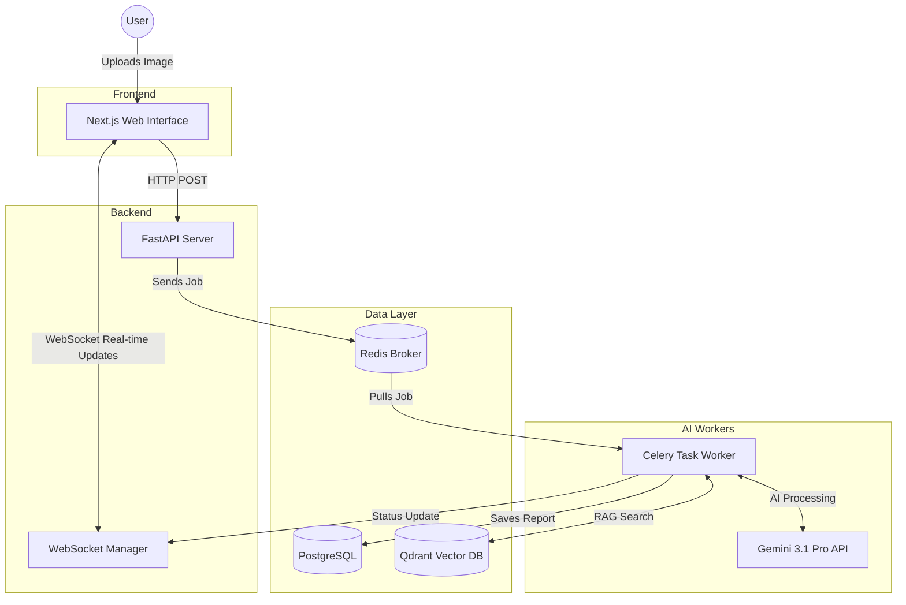
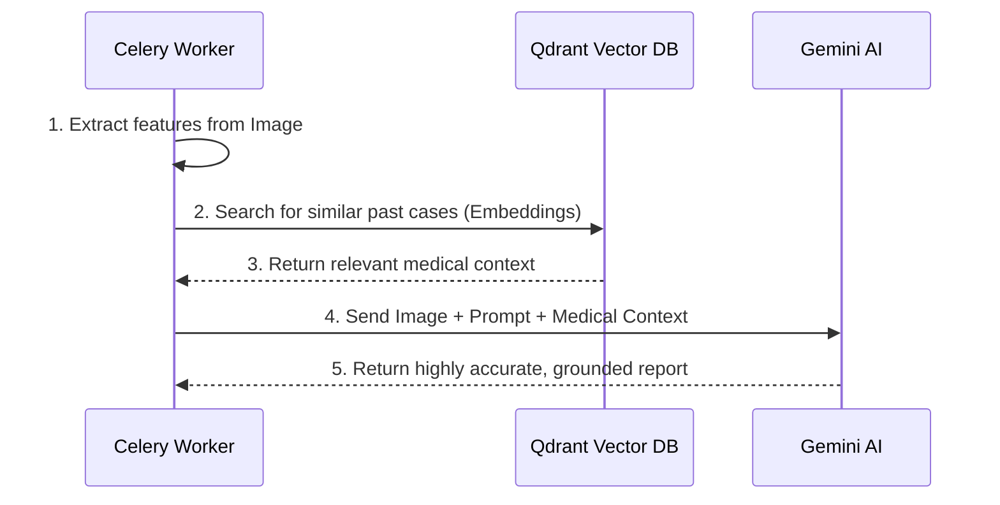
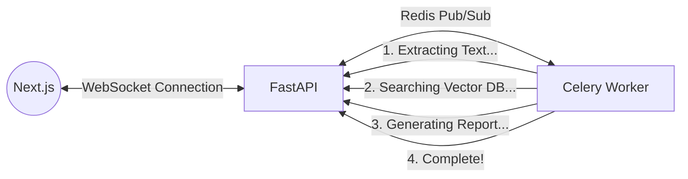

# 🚀 Lumenis AI: The Complete Beginner & Interview Guide

Welcome! This interactive guide is designed to explain **Lumenis AI** from the ground up, complete with diagrams and deep-dives. 

👉 <strong>How to use this guide (Click to expand)</strong>

Read through the concepts linearly. When you see interactive dropdowns like this one, click them to reveal interview questions, answers, and deep technical secrets.

---

## 1. What is Lumenis AI? (The Plain English Explanation)

Imagine a highly experienced doctor looking at an X-ray, MRI, or a dense medical report. They instantly translate it into plain English for a patient or a junior doctor, highlighting the severe parts. 

**Lumenis AI** is a web application that does exactly this. It is a **multimodal AI system**. 
- **Multimodal** means it understands *multiple modes* of data—specifically, images (X-rays, scans) and text (clinical PDFs).
- A user uploads a medical image. The application processes it, looks up relevant medical context, and uses a powerful AI (Google Gemini 3.1 Pro) to generate a structured clinical report.

---

## 2. System Architecture: The Big Picture

To build a modern AI application, we separate the concerns. Heavy AI processing would cause a standard website to freeze. 

Here is the high-level flow of the entire application:

### Breaking Down the Architecture:

<strong>1. The Frontend (Next.js & Vanilla CSS)</strong>

 
This is the user-facing website. We use Next.js (React) for a snappy, modern feel.   
<strong>Why Vanilla CSS?</strong> Instead of using Tailwind, we used strict Vanilla CSS to enforce a very clean, minimalist "Zero-radius" design system. It looks like a high-end Electronic Health Record (EHR) system.

<strong>2. The Backend Server (FastAPI)</strong>

 
FastAPI acts as the traffic cop. It's built in Python and is completely asynchronous. This means if 100 users upload an image at the exact same time, FastAPI handles all the requests immediately without getting blocked.

<strong>3. The Asynchronous Workers (Celery & Redis)</strong>

 
AI takes a long time (10-30 seconds). If FastAPI waited for the AI, the user's browser would spin endlessly.  
Instead, FastAPI says, "I got your image!" and hands the heavy lifting to <strong>Celery</strong> (a background worker). <strong>Redis</strong> acts as the waiting line (message broker) holding the tasks until Celery is ready to process them.

---

## 3. Deep Dive: The RAG Pipeline (Retrieval-Augmented Generation)

This is the most critical concept for your interviews. Large Language Models (LLMs) like Gemini are smart, but they can **hallucinate** (make things up). In medicine, this is unacceptable.

To fix this, we use **RAG**. It acts like an "open-book test" for the AI.

### What is a Vector Database (Qdrant)?
Traditional databases search for exact words (e.g., searching for "fracture"). A Vector Database stores the **meaning** of words as arrays of numbers called *embeddings*. This means if you search for "broken bone," the Vector DB knows it's the same concept as "fracture" and returns the right medical context.

---

## 4. Deep Dive: WebSockets (Real-Time Magic)

How does the user know what the AI is doing in the background? We use **WebSockets**.

Instead of the user having to refresh the page to see if their report is done, WebSockets create an open, two-way tunnel. The Celery worker broadcasts its current step, and the frontend updates a progress bar instantly.

---

## 5. The Interview: Questions & Answers

Recruiters want to know *why* you made certain decisions and *how* you built it. Click the questions to reveal the answers.

<strong>🗣 Q1: "Why did you choose FastAPI over Django or Flask?"</strong>

 
"I chose FastAPI because this is an AI-heavy application. FastAPI is built from the ground up for asynchronous programming (`async/await`). It allowed me to handle multiple file uploads and WebSocket streaming for real-time UI updates much more efficiently than standard synchronous frameworks like Django or Flask."

<strong>🗣 Q2: "How do you handle the fact that AI generation takes a long time? Doesn't the app freeze?"</strong>

 
"I explicitly designed an asynchronous architecture to prevent freezing. I used Celery with a Redis message broker. When a user uploads a scan, the backend immediately hands the heavy processing to a background worker. I then use WebSockets to stream the progress back to the Next.js frontend so the user gets a real-time, interactive loading experience."

<strong>🗣 Q3: "Can you explain what a Vector Database is and why you used Qdrant?"</strong>

 
"Traditional databases like Postgres search for exact keyword matches. But AI thinks in concepts. A Vector DB like Qdrant stores data as arrays of numbers (embeddings) that represent meaning. I used it for the RAG pipeline. I can search Qdrant for *semantically similar* medical literature to feed into the LLM as context, grounding its output and preventing hallucinations."

<strong>🗣 Q4: "What makes this system 'Multimodal'?"</strong>

 
"Standard LLMs only take text in and put text out. Lumenis AI is multimodal because it takes in unstructured visual data (DICOMs, JPEGs) *alongside* text context, and processes both simultaneously to generate the final structured clinical report."

---

## 6. Interview Strategy: Using AI as a Developer Tool

It is **100% acceptable and encouraged** to tell recruiters that you used AI (like ChatGPT, GitHub Copilot, or Gemini) to build parts of this project. Modern engineering is about efficiency. The trick is knowing *what* is okay to automate.

If an interviewer asks, *"Did you use AI to help you write this code?"*

<strong>🗣 How to answer perfectly:</strong>

 
"Yes, absolutely. I strongly believe in using AI to accelerate development, but I am very strategic about *where* I use it. 
  
<strong>What I automated with AI:</strong>
<ul>
<li><strong>Boilerplate Code:</strong> I used AI to generate the standard Dockerfile setups, the basic SQLAlchemy database models, and repetitive CSS scaffolding. Writing these by hand is tedious and doesn't add unique value to the project.</li>
<li><strong>Mock Data:</strong> I used AI to generate the dummy medical reports and initial vector data to seed my database for testing.</li>
</ul>
 
<strong>What I designed myself (The Hard Parts):</strong>
<ul>
<li><strong>The Architecture:</strong> AI can write a function, but it can't orchestrate a Celery worker passing WebSocket messages through Redis to a Next.js frontend. I designed that data flow.</li>
<li><strong>The RAG Pipeline:</strong> Tuning how the embeddings are fetched and engineering the exact prompt provided to Gemini to ensure the clinical outputs were safe and didn't hallucinate.</li>
</ul>
By automating the repetitive parts, I had more time to focus on the complex, asynchronous system design."

