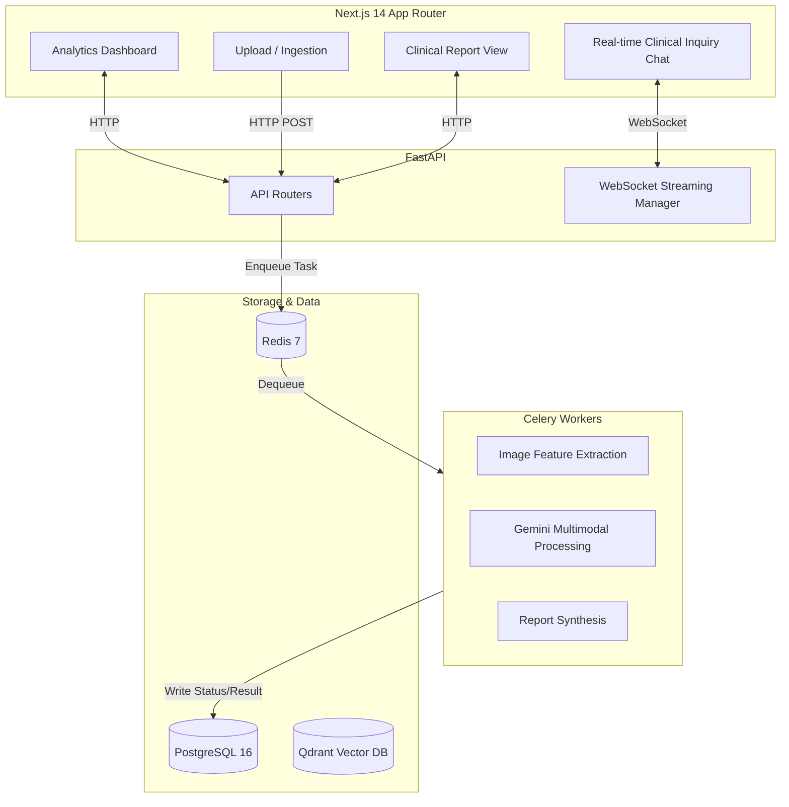

# Lumenis AI
 
> A minimalist, high-end SaaS platform for automated medical imaging analysis.

Lumenis AI is a multimodal AI system that takes medical images (DICOM, JPEG, PNG) or clinical PDF reports as input and returns a structured, plain-English explanation of the findings — complete with severity indicators and grounded medical context.

Built with a rigorous, minimalist design system, Lumenis AI strips away "AI buzzwords" and provides a clean, professional Electronic Health Record (EHR) style interface for clinical inquiry.

---

## 🏗 Architecture Overview

Lumenis AI uses a modern, scalable architecture designed for heavy asynchronous AI processing:



### The Core Processing Pipeline
When a file is uploaded, a Celery worker executes the core pipeline:
1. **Feature Extraction**: Normalizes DICOM/JPEG images or extracts text from clinical PDFs.
2. **Analysis**: Uses **Gemini 3.1 Pro** to analyze the input and return structured clinical findings.
3. **Report Synthesis**: Compiles the findings into a comprehensive SaaS report with an overall severity rating and interactive layout.

---

## 🛠 Tech Stack

### Frontend
- **Framework**: Next.js 14 (App Router)
- **Design System**: Strict Monochrome Minimalist (Vanilla CSS, no Tailwind)
- **Icons**: Lucide React
- **Features**: Drag-and-drop, WebSocket streaming, Zero-radius UI

### Backend
- **Framework**: FastAPI (Python 3.11)
- **Database ORM**: SQLAlchemy + asyncpg
- **Task Queue**: Celery + Redis
- **AI Core**: Google Gemini API
- **Vector Search**: Qdrant

### Infrastructure
- **Containerization**: Docker & Docker Compose
- **Database**: PostgreSQL 16
- **CI/CD**: GitHub Actions

---

## 🚀 Getting Started (Local Development)

### Prerequisites
- Docker and Docker Compose
- Python 3.11+
- Node.js 20+
- A Google Gemini API Key

### Installation

1. **Environment Variables**:
   Copy the example config:
   ```bash
   cp .env.example .env
   ```
   Add your `GEMINI_API_KEY` to the `.env` file.

2. **One-Command Setup**:
   Use the provided bash script to build and start the entire stack:
   ```bash
   chmod +x scripts/setup.sh
   ./scripts/setup.sh
   ```
   *This command builds the Docker images, starts Postgres, Redis, Qdrant, Celery, FastAPI, Next.js, and runs the Alembic database migrations automatically.*

### Accessing the Platform
- **SaaS Dashboard**: [http://localhost:3000](http://localhost:3000)
- **Backend API Docs**: [http://localhost:8000/docs](http://localhost:8000/docs)
- **Qdrant Vector DB**: [http://localhost:6333/dashboard](http://localhost:6333/dashboard)

---

## 📂 Folder Structure

```
.
├── backend/
│   ├── alembic/          # Database migrations
│   ├── app/
│   │   ├── api/          # FastAPI routers (upload, chat, jobs)
│   │   ├── core/         # Settings and configurations
│   │   ├── db/           # SQLAlchemy models and session
│   │   ├── schemas/      # Pydantic validation schemas
│   │   ├── services/     # Gemini client, image processors
│   │   └── workers/      # Celery task definitions
│   ├── requirements.txt
│   └── Dockerfile
├── frontend/
│   ├── app/              # Next.js App Router pages
│   ├── components/       # React UI Components
│   ├── lib/              # API fetchers
│   └── Dockerfile
├── scripts/              # Setup and ingest scripts
├── docker-compose.yml    # Main infrastructure config
└── Makefile              # Developer command shortcuts
```

---

## 🧑‍💻 Developer Commands

For developer convenience, use the `Makefile`:
- `make dev` — Starts the full Docker Compose stack in detached mode.
- `make down` — Stops all containers safely.
- `make logs` — Streams logs from all containers.
- `make db-migrate` — Runs Alembic database migrations.
- `make db-revision m="Name"` — Creates a new database migration.
- `make backend-shell` — Opens a bash shell inside the backend container.
- `make clean` — Removes containers and named volumes (wipes the database completely).

---

## ⚠️ Disclaimer
*Lumenis AI is a research and demonstration project. It is intended for informational and educational purposes only and does not constitute a medical diagnosis. Always consult a qualified healthcare professional for clinical decisions.*
