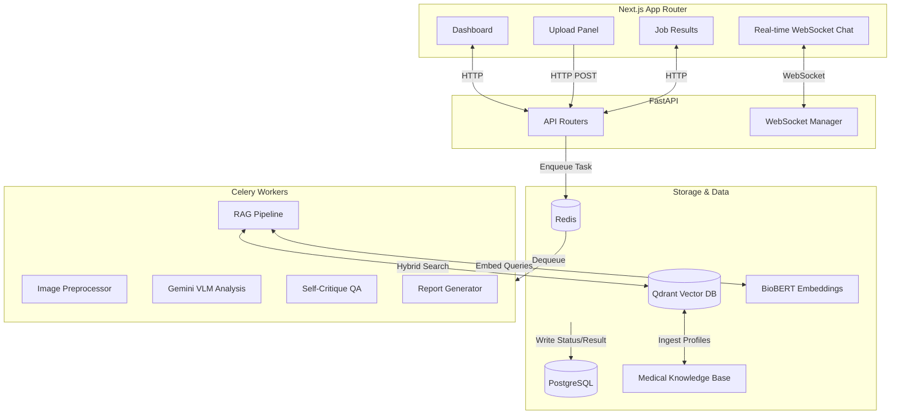

# Lumenis AI: MedLens

MedLens is a multimodal AI system that takes medical images (chest X-rays, MRIs, CT scans) or PDF lab reports as input and returns a structured, plain-English explanation of the findings — complete with severity indicators, affected regions, and follow-up recommendations grounded in medical literature.

Think of it as an AI second opinion that bridges the gap between raw medical data and patient understanding.

---

## Architecture Overview

MedLens is built using a modern, scalable architecture featuring a FastAPI backend, Celery task queue for heavy AI processing, and a Next.js App Router frontend.



### The 5-Step AI Pipeline

When an image or PDF is uploaded, the Celery worker triggers the core pipeline:

1. **Pre-processing**: Normalizes DICOM/JPEG images (windowing, CLAHE) or extracts text/sections from PDF reports.
2. **VLM Analysis**: Uses **Gemini 1.5 Pro** to analyze the multimodal input and return structured JSON findings.
3. **RAG Grounding**: Queries the Qdrant vector database (populated with 52 detailed radiology condition profiles) using BioBERT embeddings to fetch clinical context and literature citations for every finding.
4. **Self-Critique**: Runs a secondary, low-temperature Gemini instance to audit the findings (KEEP, MODIFY, REMOVE) for safety, preventing hallucinations and correcting severities.
5. **Synthesis**: Compiles the grounded, audited findings into a comprehensive report with specific clinical recommendations (e.g., Fleischner Society guidelines for nodules) and a narrative summary.

---

## Tech Stack

### Frontend
- **Framework**: Next.js 14 (App Router)
- **Styling**: Vanilla CSS with custom glassmorphism and modern design system (no Tailwind)
- **Icons**: Lucide React
- **Features**: Drag-and-drop uploads, real-time WebSocket chat, interactive image viewer

### Backend
- **Framework**: FastAPI (Python 3.11)
- **Async ORM**: SQLAlchemy + asyncpg
- **Task Queue**: Celery + Redis
- **AI Core**: Google Gemini 1.5 Pro (Multimodal)
- **Vector Search**: Qdrant + SentenceTransformers (BioBERT) + Cross-Encoder re-ranking
- **Data Processing**: PyDicom, OpenCV, PyMuPDF (fitz)

### Infrastructure
- **Containerization**: Docker & Docker Compose
- **Database**: PostgreSQL 16
- **CI/CD**: GitHub Actions

---

## Getting Started (Local Development)

### Prerequisites
- Docker and Docker Compose
- Python 3.11+
- Node.js 20+
- A Google Gemini API Key

### Setup

1. **Environment Variables**:
   Copy the example config:
   ```bash
   cp .env.example .env
   ```
   Add your `GEMINI_API_KEY` to the `.env` file.

2. **One-Command Setup**:
   Use the provided bash script to build and start the entire stack:
   ```bash
   chmod +x scripts/setup.sh
   ./scripts/setup.sh
   ```
   *This command builds the Docker images, starts Postgres, Redis, Qdrant, Celery, FastAPI, and Next.js, and then runs the Alembic database migrations automatically.*

3. **Ingest Medical Knowledge** (Optional but recommended):
   To enable RAG grounding, you need to populate the Qdrant vector database with the provided radiology conditions.
   ```bash
   make backend-shell
   python -m scripts.ingest_knowledge
   exit
   ```

### Accessing the App
- **Frontend UI**: [http://localhost:3000](http://localhost:3000)
- **Backend API Docs**: [http://localhost:8000/docs](http://localhost:8000/docs)
- **Qdrant Dashboard**: [http://localhost:6333/dashboard](http://localhost:6333/dashboard)

---

## Makefile Commands

For developer convenience, use the `Makefile`:
- `make dev` — Starts the full Docker Compose stack.
- `make down` — Stops all containers.
- `make logs` — Streams logs from all containers.
- `make db-migrate` — Runs Alembic database migrations.
- `make backend-shell` — Opens a bash shell inside the backend container.
- `make clean` — Removes containers and named volumes (wipes the database).

---

## Disclaimer
*Lumenis AI (MedLens) is a research and demonstration project. It is intended for informational and educational purposes only and does not constitute a medical diagnosis. Always consult a qualified healthcare professional for clinical decisions.*
